#  Insta View

> Instagram like app in SwiftUI for iOS, iPadOS and  macOS.
 
## macOS

<a>
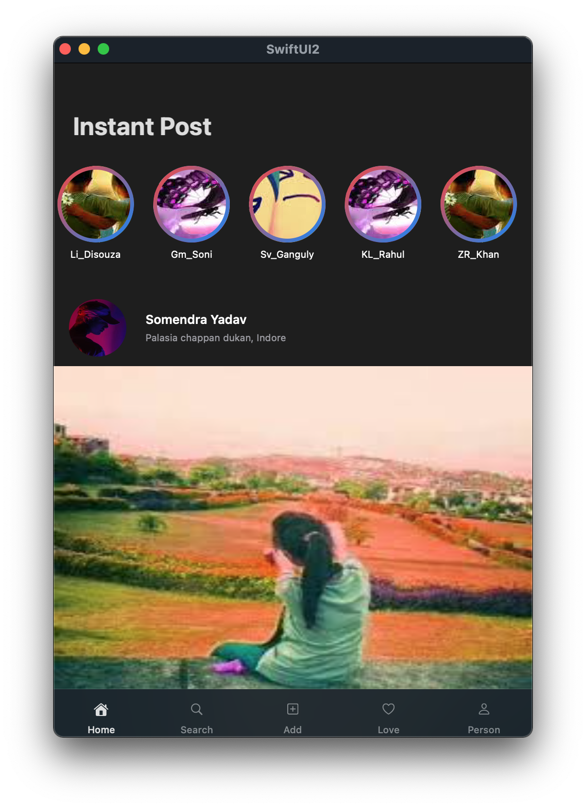
</a>
<a>
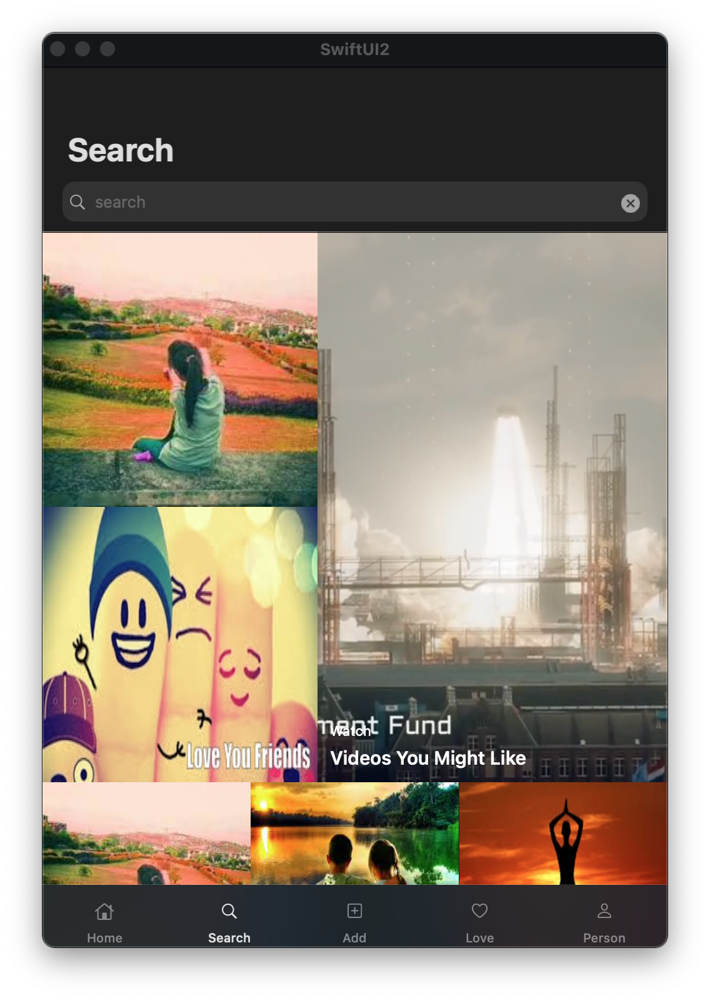
</a>
<a>
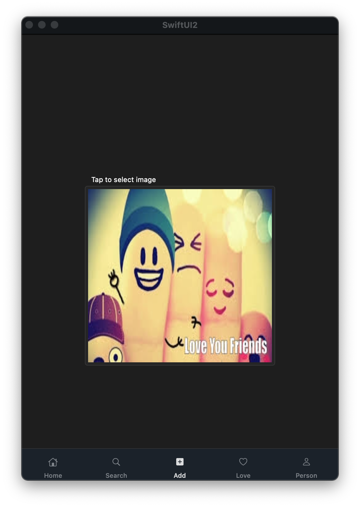
</a>
 <a>
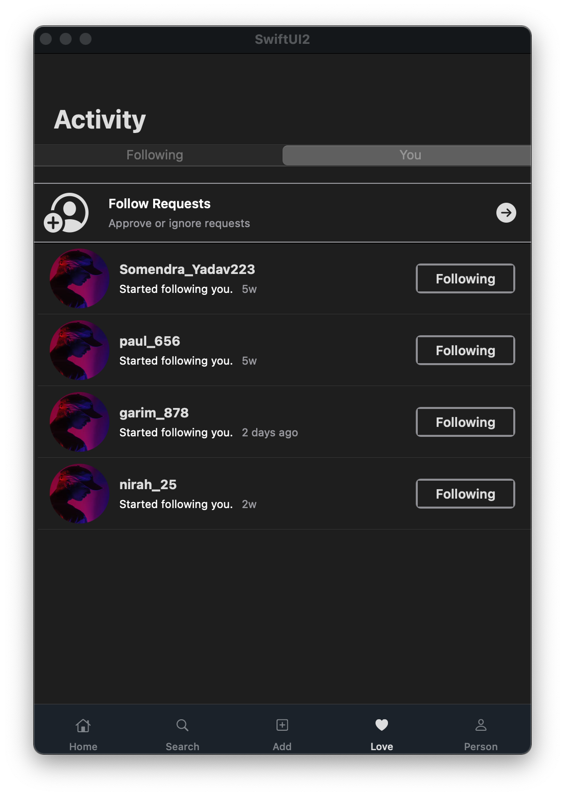
</a>
<a>
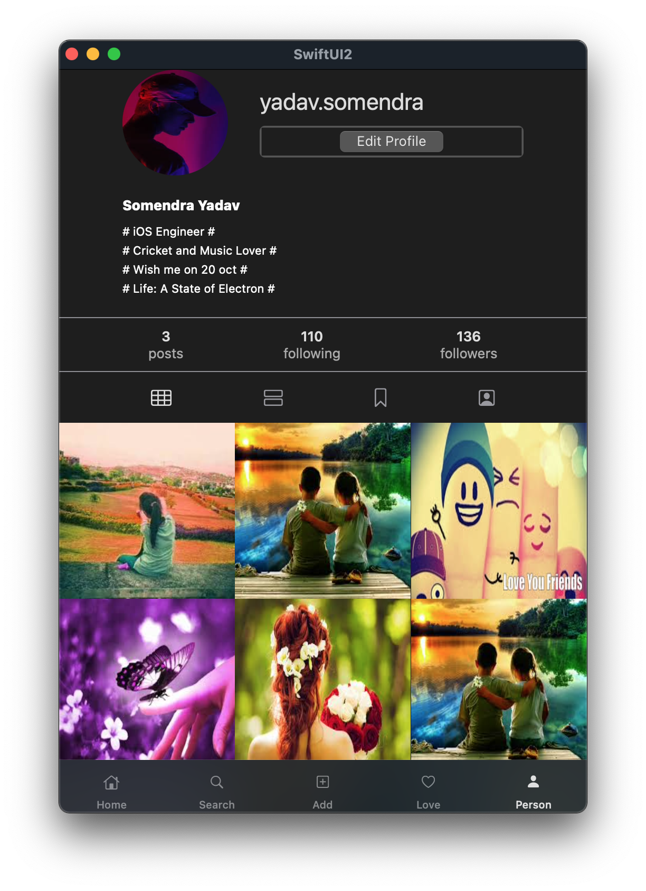
</a>

## iOS

<a>
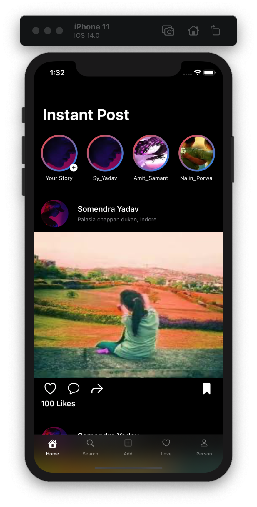
</a>
<a>
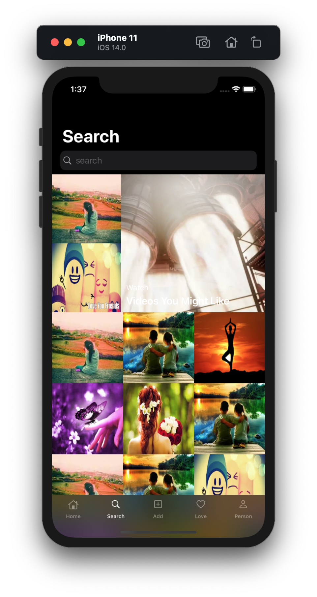
</a>
<a>
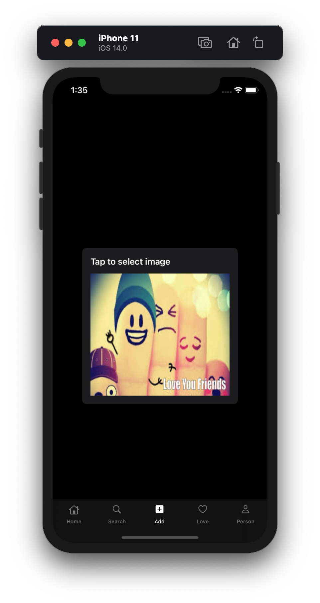
</a>
 <a>
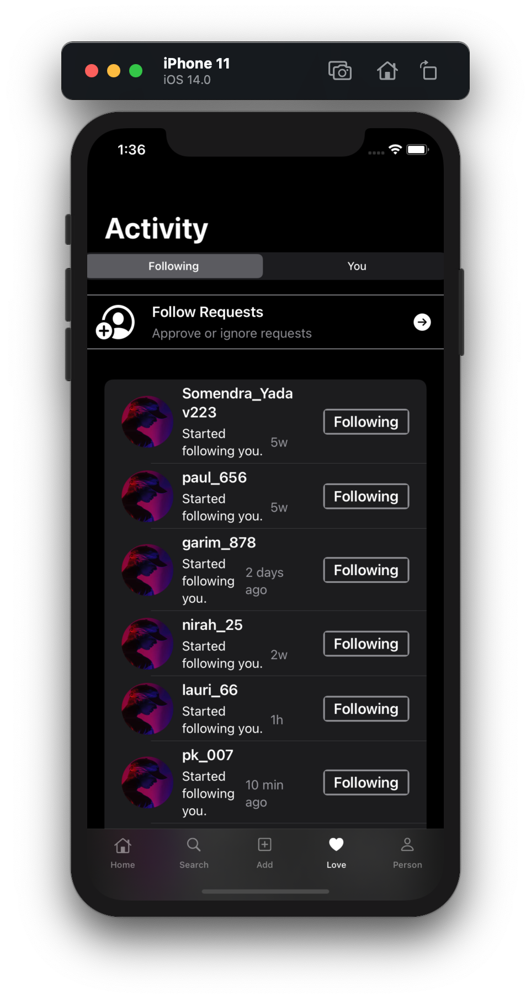
</a>
<a>
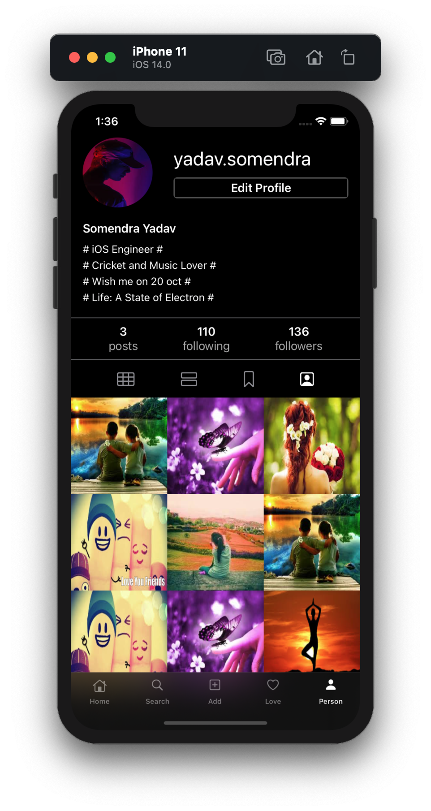
</a>

## iPadOS

<a>
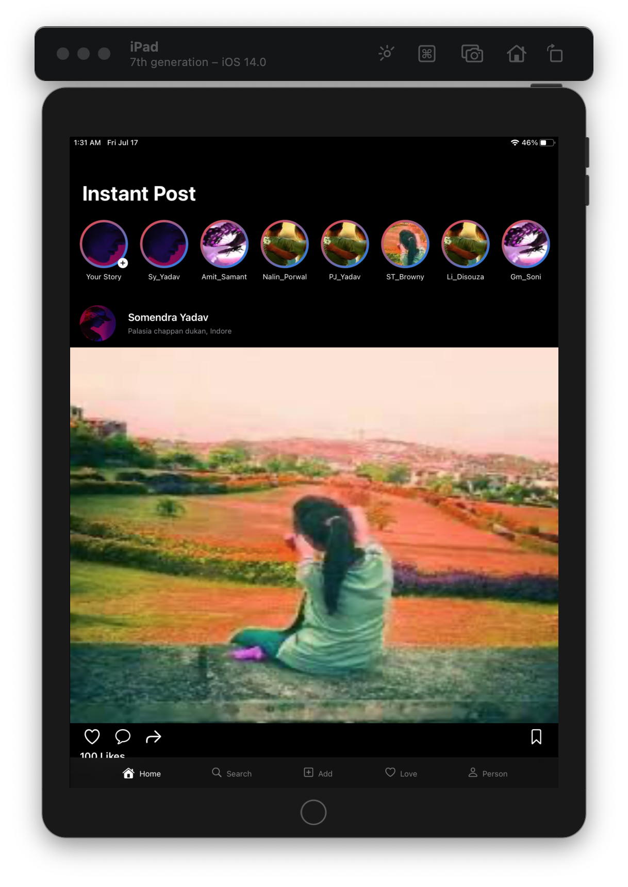
</a>
<a>
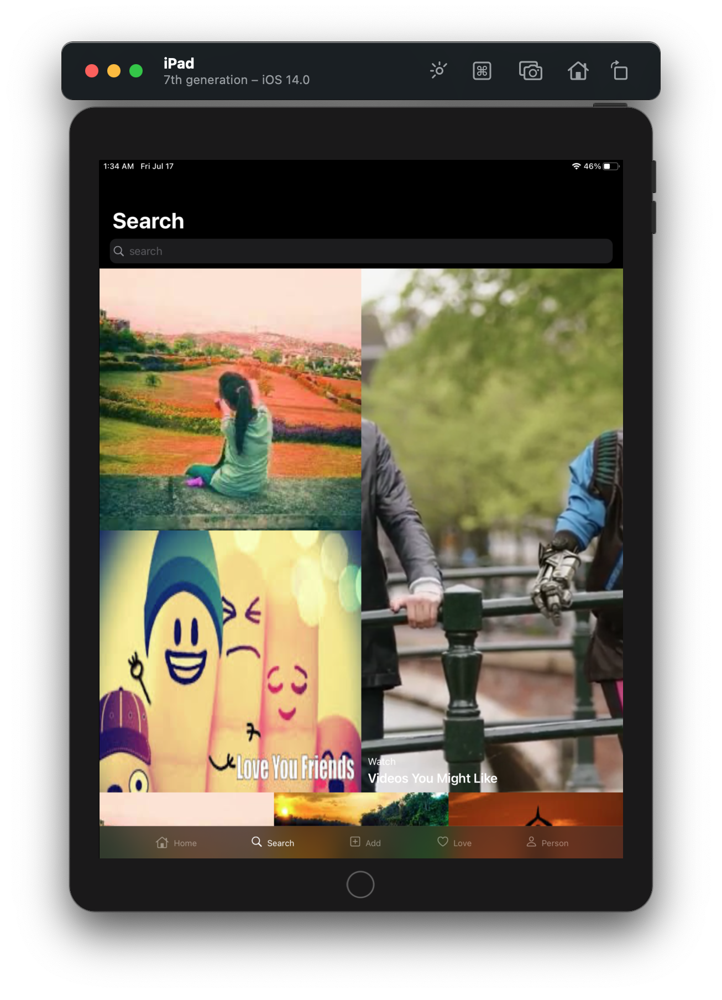
</a>
<a>
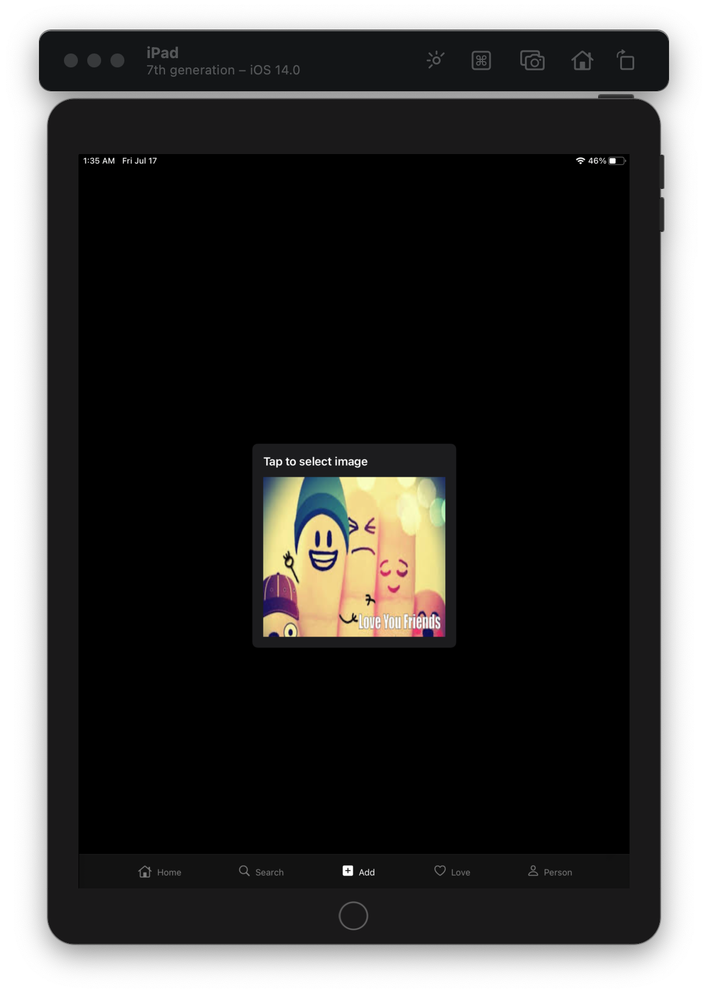
</a>
 <a>
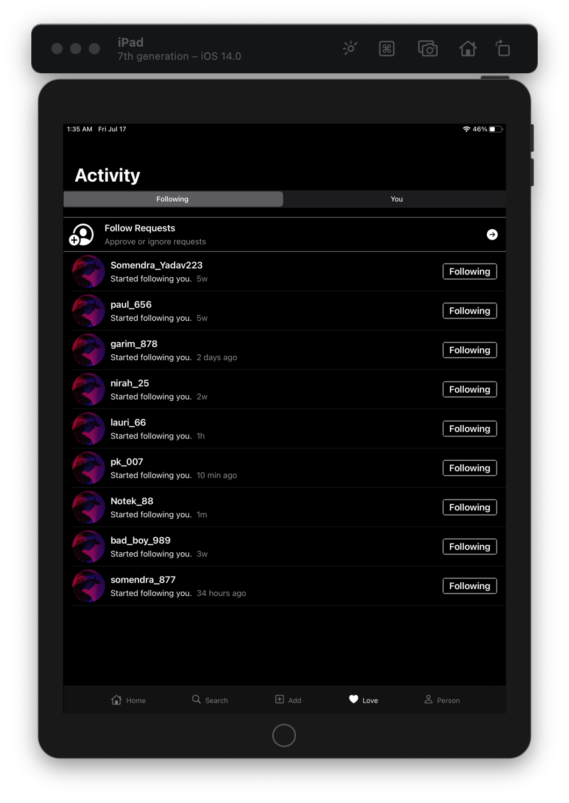
</a>
<a>
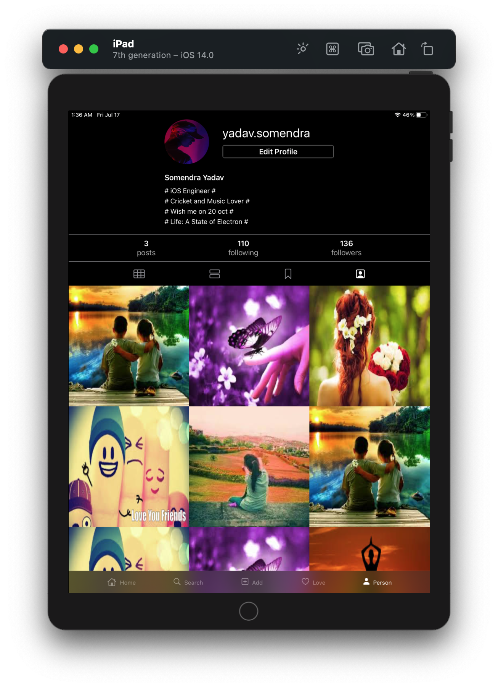
</a>

